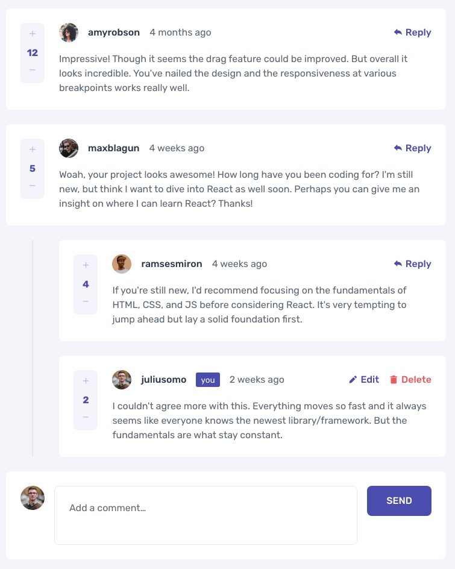

# Frontend Mentor - Interactive comments section solution

This is a solution to the [Interactive comments section challenge on Frontend Mentor](https://www.frontendmentor.io/challenges/interactive-comments-section-iG1RugEG9). Frontend Mentor challenges help you improve your coding skills by building realistic projects.

## Overview

### The challenge

Users should be able to:

- View the optimal layout for the app depending on their device's screen size
- See hover states for all interactive elements on the page
- Create, Read, Update, and Delete comments and replies
- Upvote and downvote comments
- **Bonus**: If you're building a purely front-end project, use `localStorage` to save the current state in the browser that persists when the browser is refreshed.
- **Bonus**: Instead of using the `createdAt` strings from the `data.json` file, try using timestamps and dynamically track the time since the comment or reply was posted.

### Screenshot

### Links

- Solution URL: [Solution](https://www.frontendmentor.io/solutions/interactive-comment-section-with-bouncing-animation-9yeSMNFnN)

## My process

### Built with

- Semantic HTML5 markup
- CSS custom properties
- Flexbox
- CSS Grid
- Mobile-first workflow
- [Animate.css](https://animate.style/)
- [SweetAlert](https://sweetalert.js.org/)
- [uuid](https://github.com/uuidjs/uuid)
- [BoxIcons](https://boxicons.com/)

### What I learned

- [Intl.RelativeTimeFormat](https://developer.mozilla.org/en-US/docs/Web/JavaScript/Reference/Global_Objects/Intl/RelativeTimeFormat) – Relative time format in JS

### Useful resources

- [Update Object in localstorage](https://stackoverflow.com/questions/21922349/how-to-update-json-value-in-localstorage/21922378)

## Author

- Frontend Mentor - [@Filippo-B](https://www.frontendmentor.io/profile/Filippo-B)

Interactive comment section

Hi everyone! Any feedback is appreciated.
